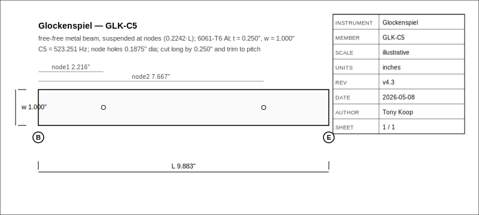
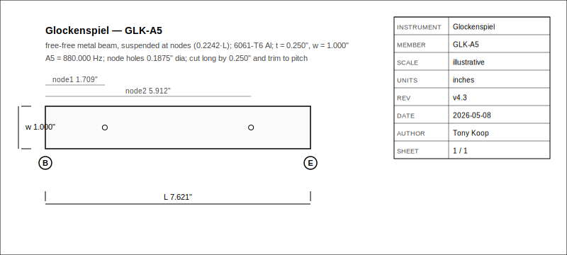
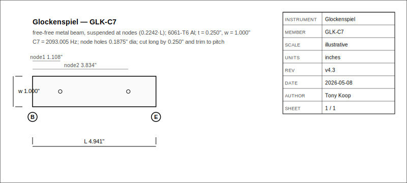
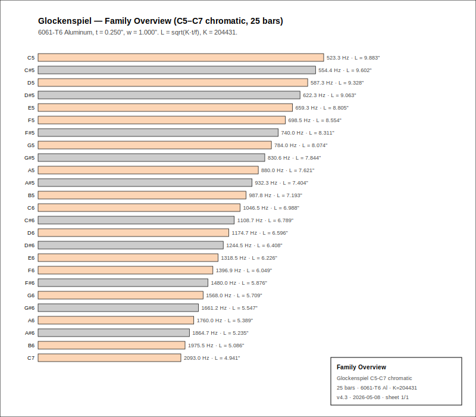
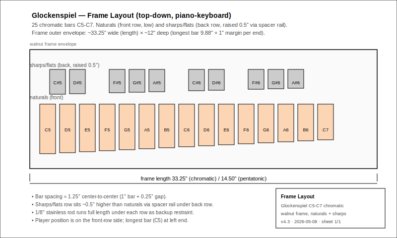
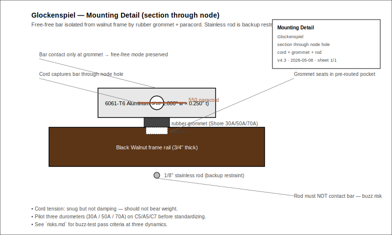

# Glockenspiel — Tuned Metal-Bar Idiophone Build Packet
- Musical instrument documentation capstone
- Build packet: glockenspiel
- Generated: 2026-05-08

---

# Project Intent
- Build a 25-bar chromatic C5-C7 glockenspiel from the existing workbook design table, with a parallel 10-bar C-major-pentatonic art-fair variant sharing the same aluminum stock and frame jig.
- 6061-T6 aluminum bars (0.25 in × 1.00 in flat stock) on a CNC-routed Black Walnut frame.
- Free-free beam acoustics, no arch undercut, no resonator tubes.
- Cord-through-node-holes mounting with rubber grommets and 1/8 in stainless support rods.
- All published lengths are first-pass cut-long targets; effective K is recalibrated from a C5/A5/C7 pilot.

_Speaker notes:_ Read design.md before committing to dimensions or sourcing decisions. The K-calibration pilot is non-optional.

---

# Physics Model
- ### Free-Free Beam (Metal)

```
lambda_1 = 4.730
f_1 = (lambda_1^2 / (2*pi*L^2)) * sqrt(E*I/(rho*A))
```

```
f ~= K * t / L^2
L ~= sqrt(K * t / f)
```

```
material = 6061-T6 Aluminum
K = 204431 (imperial: t and L in inches, f in Hz)
t = 0.250 in
w = 1.000 in
```

```
K_metal = (4.730^2 / (2*pi)) * sqrt(E / (12*rho)) / 0.0254
node_1 = 0.2242 * L
node_2 = 0.7758 * L
```

_Speaker notes:_ Width does NOT affect frequency. Per `references/acoustic-models.md`, NAF K2 corrections, vessel Helmholtz corrections, and cantilever wood K-tables do NOT apply. The honest correction loop is per-lot K calibration from pilot measurements.

---

# Material Decision Matrix
- 6061-T6 Aluminum (default): K=204431, bright bell-like, long sustain, lowest cost.
- Brass C260: K=145325, warm classic glock tone, premium cost.
- Steel 1018: K=204267 (similar to Al), harsh and very loud.
- 304 Stainless: K=198770, clean modern tone, weather-resistant.
- Phosphor Bronze: K=142593, richest sustain, highest cost.
- To switch metals: replace K in `family-spec.csv` and recompute `predicted_length_in = sqrt(K*t/f)`.

_Speaker notes:_ Aluminum and Steel have nearly identical K because the E/rho ratio is similar; the practical difference is mass and timbre, not length.

---

# Bar Schedule (chromatic + pentatonic)
- 25 chromatic bars C5-C7 (full schedule in `family-spec.csv`).
- 10 pentatonic bars (C5,D5,E5,G5,A5,C6,D6,E6,G6,A6) — art-fair "no wrong notes" variant.

| Note | MIDI | Target Hz | Length in | Node 1 in | Node 2 in |
| --- | ---: | ---: | ---: | ---: | ---: |
| C5 | 72 | 523.251 | 9.883 | 2.216 | 7.667 |
| A5 | 81 | 880.000 | 7.621 | 1.709 | 5.912 |
| C6 | 84 | 1046.502 | 6.988 | 1.567 | 5.422 |
| A6 | 93 | 1760.000 | 5.389 | 1.208 | 4.181 |
| C7 | 96 | 2093.005 | 4.941 | 1.108 | 3.834 |

_Speaker notes:_ Lengths assume K = 204431. Always cut at predicted + 0.25 in trim allowance. K_eff is calibrated from pilot bars before the full run.

---

# Mounting And Frame
- Piano-keyboard layout: naturals (15) front row, sharps/flats (10) back row raised 0.5 in.
- Each bar drilled with 3/16 in node holes; cord captures the bar at both nodes.
- Rubber grommets seat in CNC-routed walnut pockets; durometer (Shore 30A/50A/70A) chosen via pilot.
- 1/8 in stainless rod runs full row length as backup restraint (must NOT contact bar).
- Frame envelope: 33.25 in (chromatic) or 14.50 in (pentatonic) wide × ~12 in deep.

_Speaker notes:_ Mounting damping is the structural risk that dominates sustain. See `risks.md`.

---

# Hardware Alignment
- Bar marking & cutting: bench-top (chop saw + stop-block sled).
- Node hole drilling: drill press + V-block jig + hardwood backer.
- Bar tuning: belt sander or fine bench file, symmetric trim.
- Frame routing: CNC router (the only true CNC operation in this build).
- Mounting: cord + grommet + stainless rod, all bench-top.
- Validation: chromatic tuner (>= 2 kHz), microphone for sustain logging.

_Speaker notes:_ The frame is the only CNC step. Everything else is bench-top with simple jigs from `jig-decision.md`.

---

# How To Use This Packet
- Start with design.md for intent and assumptions.
- Use bom.csv, sourcing.csv, and cut-list.csv before buying or cutting.
- Use drawing-brief.md, drawings/, cad/, and cnc/ before machining.
- Use jig-decision.md as the shop stop/go sheet.
- Use validation.csv as the K-calibration and tuning log.
- Print the packet for shopping, shop work, and validation.

---

# File Map
- design.md: Project intent, governing model, material decision matrix, mounting strategy, validation plan.
- family-spec.csv: 25 chromatic + 10 pentatonic bar dimensions.
- bom.csv: Bar set + frame + hardware + mallets + tooling + measurement gear.
- sourcing.csv: Supplier candidates with all prices marked "not verified".
- cut-list.csv: Bar stock, walnut frame stock, jig material.
- validation.csv: prebuild rows for all 35 bars + per-stage rows (flat_bar/post_trim/mounted/framed) for C5/A5/C7 pilots.
- assembly-manual.md: Pilot-first build philosophy and full bench workflow.
- supplier-rfq.md: RFQ template covering aluminum + alternates + walnut + hardware + tooling.
- drawing-brief.md: Five drawing classes with tolerances.
- visual-bom-brief.md: Image-forward BOM plate spec.
- risks.md: Acoustic / structural / ergonomic / supply / fit-finish risk register.
- photo-shotlist.md: Build-log photo plan.
- resources.md: Provenance, family context, public-safety inventory.
- jig-decision.md: Pilot fixture decisions and release gates.
- drawings/: Per-pilot bar SVGs, family-overview, frame-layout, mounting-detail, visual-bom-plate.
- cad/: OpenSCAD master + SolidWorks contract (CSV + plan).
- cnc/: cnc-plan.json, operations.csv, setup-sheet.md (frame-routing focus).
- jigs/: Pilot fixture artifacts as built.
- wolfram/: glockenspiel-wolfram-model.wl with kMetal/lBar/Manipulate/validation plot.
- site/: Build-log static site.

---

# Family Spec

| Note | MIDI | Hz | L in | Node 1 | Node 2 |
| --- | ---: | ---: | ---: | ---: | ---: |
| C5 | 72 | 523.251 | 9.883 | 2.216 | 7.667 |
| C#5 | 73 | 554.365 | 9.602 | 2.153 | 7.449 |
| D5 | 74 | 587.330 | 9.328 | 2.091 | 7.237 |
| E5 | 76 | 659.255 | 8.805 | 1.974 | 6.831 |
| G5 | 79 | 783.991 | 8.074 | 1.810 | 6.264 |
| A5 | 81 | 880.000 | 7.621 | 1.709 | 5.912 |
| C6 | 84 | 1046.502 | 6.988 | 1.567 | 5.422 |
| E6 | 88 | 1318.510 | 6.226 | 1.396 | 4.830 |
| A6 | 93 | 1760.000 | 5.389 | 1.208 | 4.181 |
| C7 | 96 | 2093.005 | 4.941 | 1.108 | 3.834 |

_Speaker notes:_ Full 25-bar schedule plus 10-bar pentatonic block in family-spec.csv. All values first-pass; pilot K calibration corrects them.

---

# Build Workflow
- Receive aluminum stock and verify dimensions.
- Mark bar lengths and node positions per family-spec.csv.
- Cut bars to length (cut long by 0.25 in).
- Drill node holes on drill press with V-block jig.
- Strike-test pilot bars (C5/A5/C7) on foam supports; calibrate K_eff.
- Trim to pitch with symmetric end removal.
- CNC-route walnut frame rails and grommet pockets.
- Run mounting prototype rig with three durometer grommets.
- Assemble frame and mount all bars.
- Final validation: every bar within +/- 5 cents at soft dynamic.

---

# Sourcing And BOM
- Primary metal: 6061-T6 Aluminum 1/4" × 1" flat bar (~18 ft for chromatic + pentatonic + scrap).
- Frame: Black Walnut 4/4 dressed to 3/4" thick (about 6 board feet).
- Hardware: paracord, three durometer grommets, 1/8" stainless rod, rubber feet, fasteners.
- Mallets: hard rubber (default) + brass (orchestral upgrade) + optional lexan/Delrin.
- Tooling: 1/4" downcut + 1/8" upcut router bits, 3/16" drill bit, 80T non-ferrous chop-saw blade.
- Measurement: chromatic tuner with 2 kHz+ range (Peterson StroboClip HD).
- All sourcing.csv prices marked "not verified" — verify before purchase.

---

# Shop Packet
- cut-list.csv for stock planning.
- assembly-manual.md for away-from-keyboard work.
- validation.csv for measured Hz, cents error, sustain, timbre.
- Pilot gate: don't cut all 25 bars until C5/A5/C7 pass `flat_bar`, `post_trim`, `mounted`, `framed`.

---

# Drawings, CAD, CNC
- drawing-brief.md defines required views and tolerances.
- drawings/ has three pilot bar SVGs + family-overview + frame-layout + mounting-detail + visual-bom-plate.
- cad/ has OpenSCAD master + SolidWorks contract (CSV + plan).
- cnc/ has the frame-routing operation graph (no bar CNC).
- jigs/ collects pilot fixture artifacts.









---

# Validation Plan
- Pilot: cut C5, A5, C7 cut-long; mass-and-strike test; compute K_eff = f * L^2 / t.
- If pilot K_eff differs from workbook K by more than 5%, update family-spec.csv and workbook B21 before cutting remaining bars.
- Trim each bar to within +/- 10 cents (pilots) or +/- 5 cents (production) by symmetric end removal.
- Mount on prototype rig with three durometer grommets; pick the one that preserves >= 75% of flat-bar sustain.
- Mount all bars on walnut frame; run final framed validation row.
- Cents error: cents = 1200 * log2(measured_hz / target_hz).

---

# Open Risks / Decisions
- Aluminum mill-lot K variance can shift pitch 5-10%; pilot calibrates per lot.
- Grommet durometer dominates sustain; pilot Shore 30A/50A/70A before standardizing.
- Striker hardness (brass / hard rubber / lexan) shifts timbre dramatically; ship at least two pairs.
- Frame ergonomics (bar reach, accidental row offset, transport) need full-size taped layout.
- Clear-coat finish on aluminum can shift pitch 3-10 cents flat; tune after finish or leave raw.
- Workbook K constants (B16-B20) are first-pass; recalibrate per lot from pilot data.

---

# Next Actions
- Cut C5/A5/C7 pilot bars and measure K_eff.
- Pilot the three durometer grommets; pick one and record decision.
- CNC-route the walnut frame after K and durometer are confirmed.
- Cut the remaining 22 chromatic bars (or 7 pentatonic) using calibrated K.
- Assemble, validate, photograph, and update validation.csv.
- Replace TBDs with measured/source-backed values.
- Verify live supplier prices and availability before buying.

---
